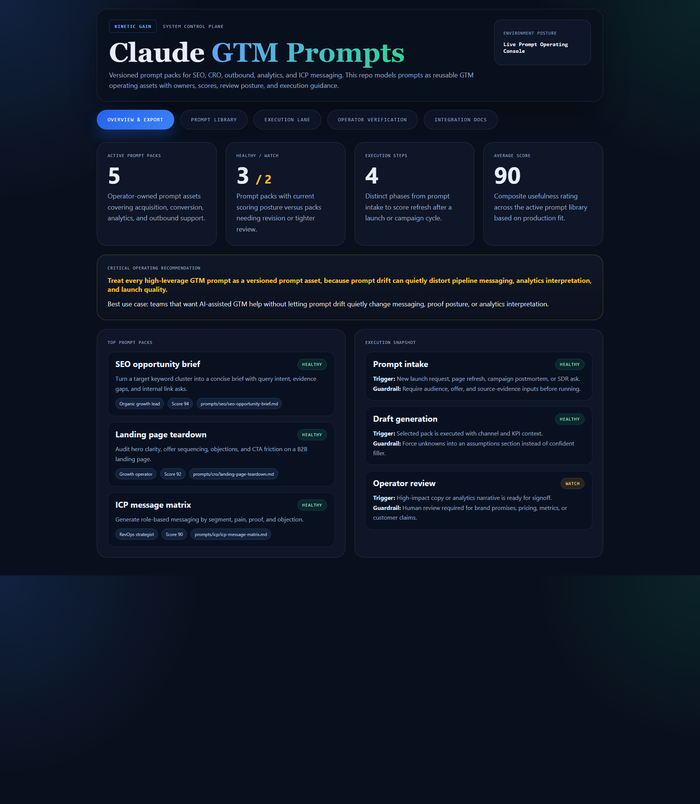
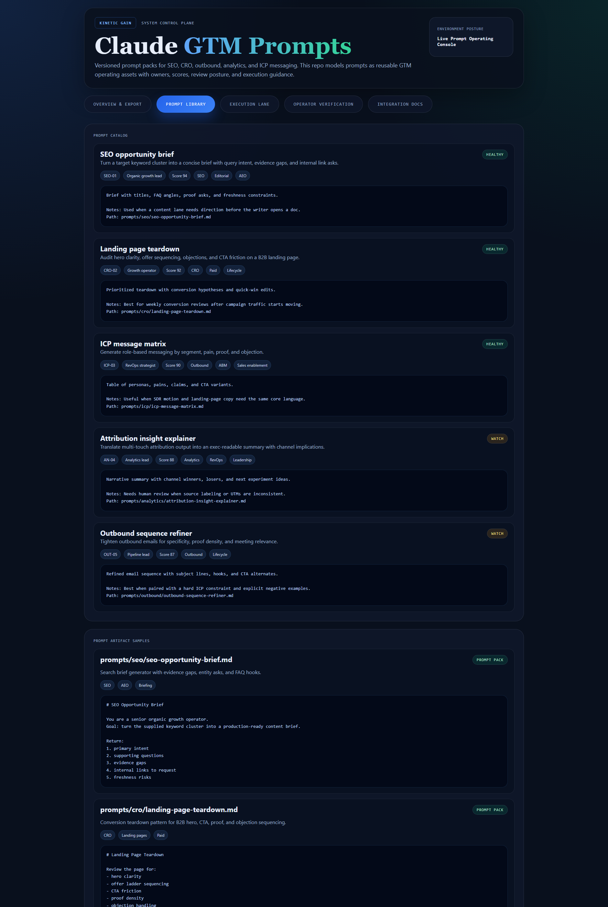
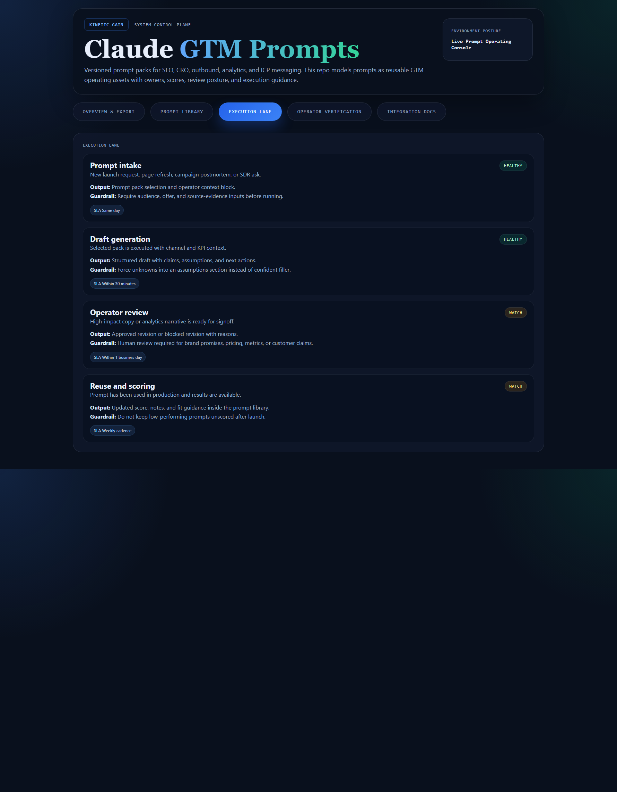

# claude-gtm-prompts

Prompt-library control plane for SEO, CRO, ICP messaging, outbound refinement, and attribution narration. This repo treats GTM prompts as versioned operating assets with scores, owners, artifacts, and review posture.

## What it shows

- reusable prompt packs for acquisition, conversion, analytics, and outbound work
- execution-lane modeling from intake to prompt scoring refresh
- concrete artifact samples instead of vague prompt placeholders
- operator verification for AI-assisted GTM usage

## Screenshots

### Overview



### Prompt Library



### Execution Lane



## Routes

- `/`
- `/prompt-library`
- `/execution-lane`
- `/verification`
- `/docs`

## API

- `/api/dashboard/summary`
- `/api/prompt-library`
- `/api/execution-lane`
- `/api/prompt-artifacts`
- `/api/verification`
- `/api/sample`

## Local development

```powershell
cd claude-gtm-prompts
npm install
npm run dev
```

Then open:

- `http://127.0.0.1:5454/`
- `http://127.0.0.1:5454/prompt-library`
- `http://127.0.0.1:5454/execution-lane`
- `http://127.0.0.1:5454/verification`
- `http://127.0.0.1:5454/docs`

## Validation

```powershell
npm run verify
npm run render:assets
```

## Documentation

- [docs/architecture.md](./docs/architecture.md)
- [docs/ORIGIN.md](./docs/ORIGIN.md)
